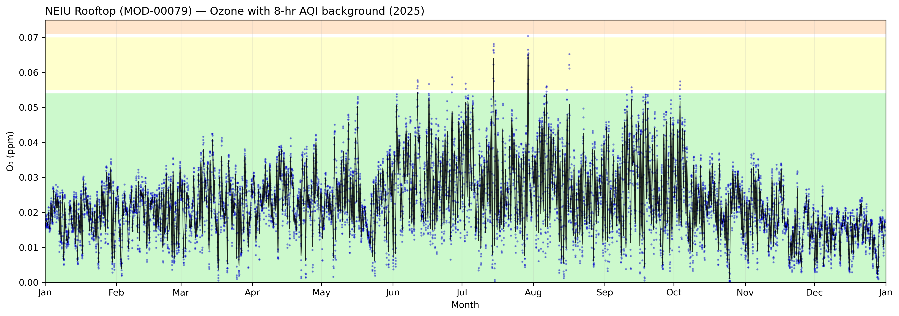
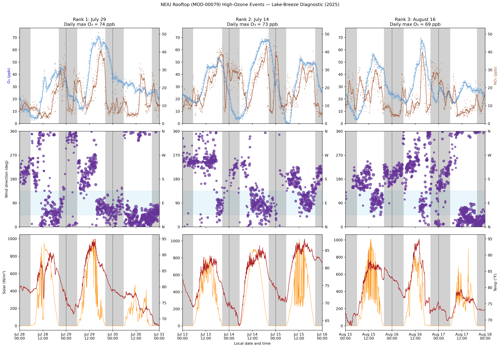
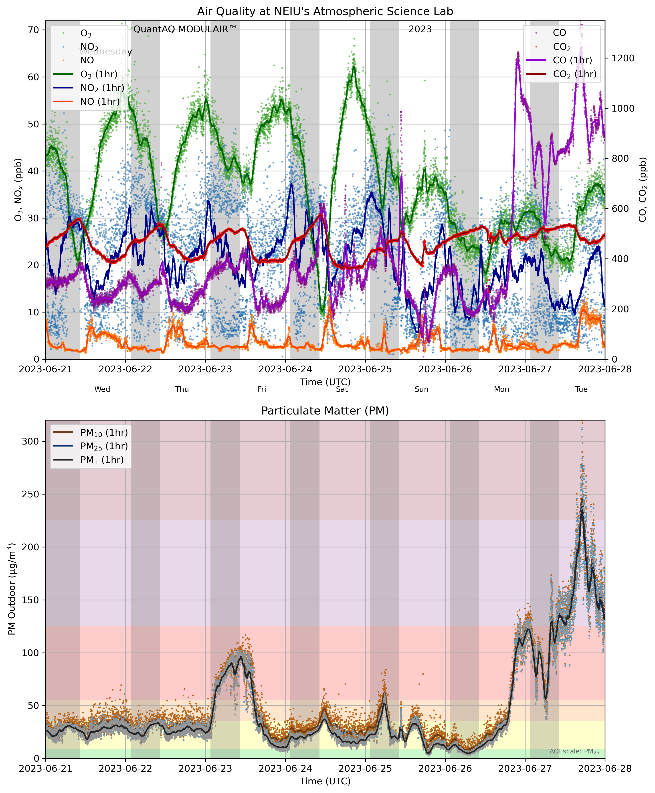
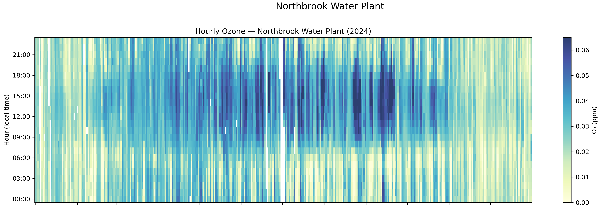

# Air Quality Analysis with Python

Python notebooks and utilities for downloading, processing, and visualizing air-quality observations in northeastern Illinois. The repository combines:

- regulatory-grade measurements from the **EPA Air Quality System (AQS)**;
- rooftop observations from a **QuantAQ MODULAIR** at Northeastern Illinois University (NEIU); and
- local meteorological data used to investigate ozone episodes, lake-breeze influences, smoke events, and multi-pollutant behavior.

CROCUS urban-observatory work that previously lived here has moved to the separate [`crocus`](https://github.com/gregorywanderson/crocus) repository.

<p align="center">
  
</p>

## Example Analyses

### High-ozone event diagnostics

The notebooks identify high-ozone periods and examine them using ozone, NO₂, wind direction, solar radiation, and temperature. These event panels are useful for investigating lake-breeze transport and local photochemical conditions.

<p align="center">
  
</p>

### Multi-pollutant observations at NEIU

The NEIU rooftop MODULAIR provides simultaneous measurements of ozone, nitrogen oxides, carbon monoxide, carbon dioxide, and particulate matter. The example below includes the June 2023 Canadian wildfire-smoke episode.

<p align="center">
  
</p>

### Diurnal and seasonal ozone structure

Calendar and hour-of-day heatmaps reveal seasonal patterns, missing-data periods, and the afternoon ozone maximum characteristic of photochemical production and transport.

<p align="center">
  
</p>

## Repository Organization

### EPA AQS ozone analyses

| File | Description |
|---|---|
| `aqs_ozone_timeseries.ipynb` | Time-series analysis of ozone observations from EPA AQS monitoring stations. |
| `aqs_ozone_study_cook.ipynb` | Cook County ozone analysis, including calendar heatmaps, high-ozone event panels, and lake-breeze diagnostics. |
| `aqs_ozone_regional.ipynb` | Regional comparison and spatial analysis of ozone across multiple AQS monitoring sites. |

### NEIU rooftop observations

| File | Description |
|---|---|
| `download_modulair_data.ipynb` | Downloads QuantAQ MODULAIR observations and archives annual CSV files locally. |
| `modulair_exploration.ipynb` | Explores archived MODULAIR observations using resampling, heatmaps, multi-pollutant time series, AQI backgrounds, and CO₂ diagnostics. |
| `neiu_ozone_study.ipynb` | Examines NEIU rooftop ozone episodes using QuantAQ gases and local meteorology, including event diagnostics and lake-breeze indicators. |

### Utility modules

| File | Description |
|---|---|
| `aqs_utils.py` | Downloads, validates, and wrangles EPA AQS observations, including datetime handling. |
| `aqs_codes.py` | Constants for commonly used AQS parameter, method, and related codes. |
| `aqi_colors.py` | AQI breakpoints and colors used for consistent figure backgrounds and interpretation. |
| `fips_codes.py` | State and county FIPS-code lookups used in AQS queries. |
| `plot_utils.py` | Shared plotting utilities, including heatmaps and nighttime or daylight shading. |

`aqi_colors.py` and `plot_utils.py` are also used by notebooks in the sibling [`crocus`](https://github.com/gregorywanderson/crocus) repository.

## Data Sources

### EPA Air Quality System

The [EPA Air Quality System](https://www.epa.gov/aqs) provides regulatory monitoring data from federal, state, local, and tribal air-quality networks. The AQS notebooks use these observations to study ozone timing, spatial variability, and regional episodes.

### NEIU QuantAQ MODULAIR

A QuantAQ MODULAIR is operated on the roof of the BBH building at NEIU. It measures particulate matter and gases including CO, CO₂, NO, NO₂, and O₃. The archived observations support exploratory analysis of diurnal cycles, pollution events, sensor coverage, and relationships among pollutants.

Meteorological observations used in the NEIU ozone analysis come from a nearby rooftop weather station.

## Getting Started

### Install dependencies

```bash
pip install -r requirements.txt
```

Some mapping notebooks use `cartopy`, which may require system-level geospatial libraries. A conda or Miniforge environment is often the easiest installation route.

### Configure API credentials

Create a `.env` file in the repository root. Do not commit this file.

For EPA AQS:

```text
AQS_USERNAME=your_email@example.com
AQS_KEY=your_api_key
```

For QuantAQ:

```text
QUANTAQ_APIKEY=your_quantaq_api_key
```

The notebooks load credentials with `python-dotenv`.

### Run the notebooks

Open a notebook and execute its cells from top to bottom. Configuration cells near the beginning specify dates, stations, pollutants, geographic regions, and figure-output directories.

A useful progression is:

1. `modulair_exploration.ipynb`
2. `aqs_ozone_timeseries.ipynb`
3. `aqs_ozone_study_cook.ipynb`
4. `neiu_ozone_study.ipynb`
5. `aqs_ozone_regional.ipynb`

Run `download_modulair_data.ipynb` only when the local QuantAQ archive needs to be created or updated.

## Figure Output

Notebook figures are written to topic-specific subdirectories under `figures/`. Images selected for display in this README are stored in:

```text
figures/github/
```

Keeping README graphics separate allows them to be resized and cropped for GitHub without replacing publication-quality PDF and PNG outputs generated by the notebooks.
